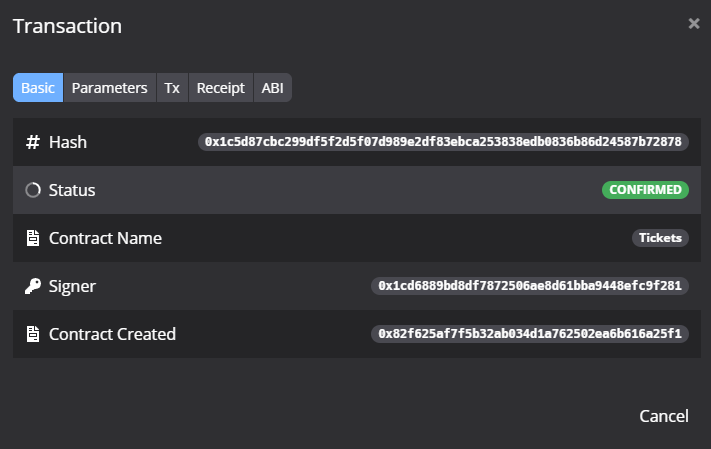
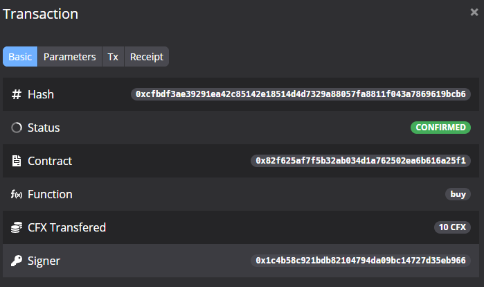
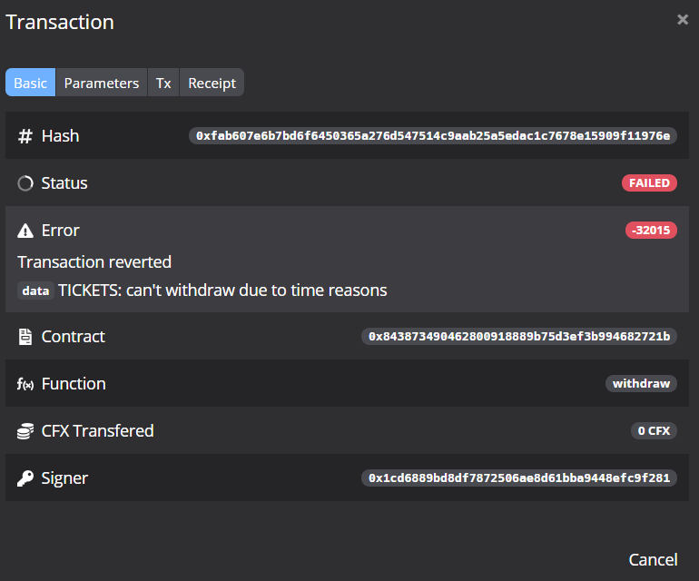

# Homework of Lecture 4

> [Lecture 4 - Homework & Resources](https://forum.conflux.fun/t/topic/3390)
>
> > Homework is done by a group.

## Conflux Studio

**3.1 Basic usage of Conflux Studio**

Download and install Conflux Studio and all the components required.

- Docker: [https://docs.docker.com/get-docker 12](https://docs.docker.com/get-docker)
- Conflux Studio: [https://github.com/ObsidianLabs/ConfluxStudio/releases/tag/v0.4.1 12](https://github.com/ObsidianLabs/ConfluxStudio/releases/tag/v0.4.1)
- Conflux Truffle, conflux-rust, solc: Install through Conflux Studio

> Done.

Download the Tickets project from the lecture ([https://github.com/Thegaram/cfx-uma-resources/raw/master/cfx-lecture-4-tickets.zip](https://github.com/Thegaram/cfx-uma-resources/raw/master/cfx-lecture-4-tickets.zip)) and import it into Conflux Studio.

> Done.
>
> 

Deploy an instance of the contract on Conflux Oceanus (hint: you can send CFX from your Conflux Portal account to your Conflux Studio account).

> get CFX from faucet: wallet.confluxscan.io/faucet/dev/ask?address={address}
>
> > To **make sure the deploying account has enough CFXs to pay transaction fees**.
> >
> > Or (send CFX from your Conflux Portal account to your Conflux Studio account)
>
> And Deploy~
>
> 

Buy a ticket from another account. Validate the ticket with the owner. Withdraw the profits.

> First, find the contract we deployed, which leads us to the contract method's panal:
>
> 
>
> And we just buy, validate, and withdraw.

Send us the address of the contract, the 4 transaction hashes (deploy, buy(), validate(), withdraw()), and screenshots of how you sent them from Conflux Studio.

> **deploy**: `0x1c5d87cbc299df5f2d5f07d989e2df83ebca253838edb0836b86d24587b72878`
>
> 
>
> **buy**: `0xcfbdf3ae39291ea42c85142e18514d4d7329a88057fa8811f043a7869619bcb6`
>
> 
>
> **validate**: `0xe4e4dbbc708a7e5e5272e8323d124052297ed4dd6ae772da8b2bc9a416b0f2d7`
>
> 
>
> **withdraw**: `0x367034b42d8cce63f19cf585b3644587e084f8456fd3a562f223dfdd7341c3f9`
>
> 

## Tickets.sol

**3.2 Customizing Tickets.sol**

Update Ticket.sol so that it becomes possible to **set the number of tickets and the price per ticket** <font color=red>when you deploy a contract</font>.

For instance, for event A, I want to sell 10 tickets of 100 CFX each. For event B, I want to sell 1000 tickets for 2 CFX each.

Test your solution on a local development network.

Send us the source code and a screenshot of deploying a contract with 33 tickets for 44 CFX each.

> Just set a few constructor's parameters and all is OK.

```rust
constructor(uint256 tickets, uint256 price) {
    owner = msg.sender;
    num_tickets = tickets;
    price_drips = price * 1e18;
}
```

> Then we get a panal with adjustable number of tickets and price for each.


> Send the transaction, and check:


### Buy tickets

**+1. Buying multiple tickets from one address [OPTIONAL]**

Update Tickets.sol so that **one user can buy multiple tickets**. For instance, Bob might want to buy 2 tickets, one for himself and one for his girlfriend.

Test your solution on a local development network.

Send us the source code and some screenshots of buying 2 or more tickets from an address and then validating them.

> Source code:

```c++
// SPDX-License-Identifier: GPL-3.0

pragma solidity ^0.7.1;

contract Tickets {
    address public owner;

    uint256 public num_tickets = 100;
    uint256 public price_drips = 10 * 1e18; // 10 CFX
    mapping (address => uint256) public has_ticket;

    event Validated(address visitor, uint256 tickets);

    constructor(uint256 tickets, uint256 price) {
        owner = msg.sender;
        num_tickets = tickets;
        price_drips = price * 1e18;
    }

    // buy ticket
    function buy(uint256 tickets) public payable {
        // check tickets
        require(num_tickets > 0 && tickets <= num_tickets && tickets > 0, "TICKETS: illegal operation");

        // check if the buying price is correct
        require(msg.value == tickets * price_drips, "TICKETS: incorrect amount");

        // successful buy
        if( has_ticket[msg.sender] != 0 )
            has_ticket[msg.sender] += tickets;
        else
            has_ticket[msg.sender] = tickets;
        num_tickets -= tickets;
    }

    // validate ticket
    function validate(address visitor) public {
        require(msg.sender == owner, "TICKETS: unauthorized");
        require(has_ticket[visitor] > 0, "TICKETS: visitor has no ticket");

        uint256 tickets = has_ticket[visitor];
        has_ticket[visitor] = 0;
        emit Validated(visitor, tickets);
    }

    // withdraw profit
    function withdraw() public {
        require(msg.sender == owner, "TICKETS: unauthorized");
        uint256 profit = address(this).balance;
        msg.sender.transfer(profit);
    }
}
```

> We set tickets_num to `2333`, and price to `1` CFX. (And buy 5 tickets.)


> buying 2 or more tickets from an address:


> validating them:


### Time of the event

+**1. Time of the event [OPTIONAL]**

Update Tickets.sol so that the organizer can set the time of the event.

Allow users to **buy tickets up to 2 hours before the event**. E.g. if the event is on 2020.12.01 19:00, you cannot buy tickets after 2020.12.01 17:00.

Allow the organizer to **withdraw the profits 1 day after the event**. E.g. if the event is on 2020.12.01 19:00, the organizer cannot withdraw the profits before 2020.12.02 19:00.

**Hints:**

- [https://solidity.readthedocs.io/en/v0.7.1/units-and-global-variables.html#block-and-transaction-properties 6](https://solidity.readthedocs.io/en/v0.7.1/units-and-global-variables.html#block-and-transaction-properties)
- [https://solidity.readthedocs.io/en/v0.7.1/units-and-global-variables.html#time-units 6](https://solidity.readthedocs.io/en/v0.7.1/units-and-global-variables.html#time-units)

> Source code:

```c++
// SPDX-License-Identifier: GPL-3.0

pragma solidity ^0.7.1;

contract Tickets {
    address public owner;

    uint256 public num_tickets = 100;
    uint256 public price_drips = 10 * 1e18; // 10 CFX
    uint256 public start;
    mapping (address => uint256) public has_ticket;

    event Validated(address visitor, uint256 tickets);

    constructor(uint256 tickets, uint256 price, uint256 upcoming_days_of_the_event) {
        owner = msg.sender;
        num_tickets = tickets;
        price_drips = price * 1e18;
        start = upcoming_days_of_the_event * 1 days + block.timestamp;
    }

    // buy ticket
    function buy(uint256 tickets) public payable {
        // check time
        require(block.timestamp <= start - 2 hours, "TICKETS: can't but due to time reasons");
        
        // check tickets
        require(num_tickets > 0 && tickets <= num_tickets && tickets > 0, "TICKETS: illegal operation");

        // check if the buying price is correct
        require(msg.value == tickets * price_drips, "TICKETS: incorrect amount");

        // successful buy
        if( has_ticket[msg.sender] != 0 )
            has_ticket[msg.sender] += tickets;
        else
            has_ticket[msg.sender] = tickets;
        num_tickets -= tickets;
    }

    // validate ticket
    function validate(address visitor) public {
        require(msg.sender == owner, "TICKETS: unauthorized");
        require(has_ticket[visitor] > 0, "TICKETS: visitor has no ticket");

        uint256 tickets = has_ticket[visitor];
        has_ticket[visitor] = 0;
        emit Validated(visitor, tickets);
    }

    // withdraw profit
    function withdraw() public {
        require(msg.sender == owner, "TICKETS: unauthorized");

        require(block.timestamp >= start + 1 days, "TICKETS: can't withdraw due to time reasons");

        uint256 profit = address(this).balance;
        msg.sender.transfer(profit);
    }
}
```

> Set the start time as 3 days later:


> Let's buy some tickets and test if we can withdraw the money ahead of schdule:


> Now we can see:
>
> > Transaction reverted
> >
> > **data** TICKETS: can't withdraw due to time reasons

