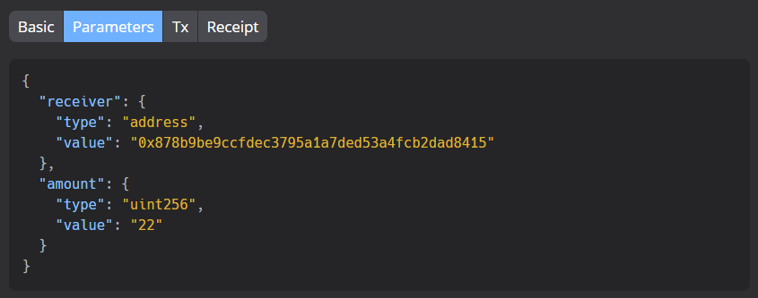
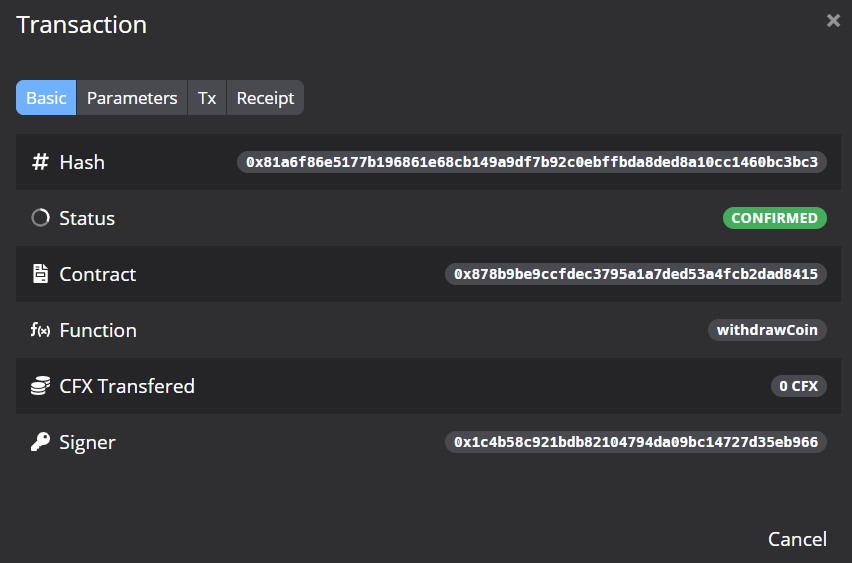
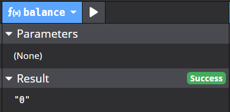

# Homework of Lecture 5

> [Lecture 5 - Homework & Resources](https://forum.conflux.fun/t/topic/3456)
>
> > Homework is done by a group.

## 3.1 Understanding the lecture

1.a) Describe some advantages of conforming to a token standard like ERC-20 or IStandardToken in a few sentences.

> <i>Conforming to a token standard ensures **interoperability** between our token and other tokens in the token standard network. This makes buying and trading our tokens easier for end users as well as investors, increasing the appeal of our token.</i>
>
> <i>We can also benefit from **unified efforts at improving the security** of our token standard. The more networks that share the same token standard, the more stakeholders concerned with the token security, the more research is done to improve the token standard security.</i>

1.b) Describe the purpose of the TimeLockedTransfer contract in a few sentences.

> <i>The TimeLockedTransfer contract allows us to **set a time for the contract execution**. This means that even if all conditions are already fulfilled by a certain time, the contract will not, or cannot, be executed until the prescribed time arrives.It can be used for **scheduled transfers** or **limiting contract accessibility**.</i>
>
> <i>If one can not withdraw his profit immediately, one might wanna make sure that his customers won't come back asking for a refund, which allows the sender to **cancel the transfer before the specified deadline**.</i>

## 3.2 Trying the lecture code

Download the project ([github.com/Thegaram/cfx-uma-resources/raw/master/cfx-lecture-5.zip 15](http://github.com/Thegaram/cfx-uma-resources/raw/master/cfx-lecture-5.zip)) and import it into Conflux Studio.

In this problem, you will have to deploy three smart contracts on your **local development network**.

First, deploy a **fixed-supply** standard coin with the name “CoinA”. Then, deploy a second instance with the name “CoinB”.

> 
>
> CoinA: 0x8ad093411fb99e82d35c6adfe494821e3d478a70
>
> 
>
> CoinB: 0x824eebd198b057a4638842247b0a788e8888ef49
>
> 

Next, deploy an instance of the TimeLockedTransfer contract. Set the unlock time to something greater than 5 minutes.

> TimeLockedTransfer: (time = 301 s > 5 min)
>
> 
>
> 

Send 17 CFX, 22 CoinA, and 12 CoinB to the transfer contract.

> Send 17 CFX:
>
> 
>
> Send 22 CoinA: (Through contract "CoinA")
>
> > send it to the TimeLockedTransfer contract address.
>
> 
>
> 
>
> Send 12 CoinB: (Through contract "CoinB")
>
> 
>
> 

After the deadline, withdraw all these tokens from the transfer contract.

> withdraw CFX:
>
> 
>
> > after:
>
> 
>
> withdraw CoinA:
>
> 
>
> 
>
> withdraw CoinB:
>
> 
>
> 
>
> > after:
> >
> > 

Document the process using screenshots and a short description of each step.

## +1. Transfer Factory [OPTIONAL]

Look at the file TransferFactory.sol. Try to understand what it does and explain it using your own words.

Show us how to deploy and use this contract.

> It creates and maintains a list of "TimeLockedTransfer" contracts.
>
> Each time the function "create" is called, a new "TimeLockedTransfer" contract is deployed.
>
> Deploy: `0x833791606cc08d5e4f5fd9a2d6953faff6c0c494`
>
> 
>
> Create: (3 times)
>
> 
>
> 
>
> 
>
> 
>
> 
>
> 
>
> And we can see those 3 contract infos: (saved in the list called "transfers")
>
> 
>
> BUT these tranfers doesn't work like I expected, and all the contract addresses are invalid.

## +1. Cancel transfer [OPTIONAL]

Modify TimeLockedTransfer.sol in a way that allows the sender to cancel the transfer before the specified deadline.

Provide a way for the sender to re-aquire all their tokens from the transfer contract after cancelling it.

> Cancel test:
>
> 
>
> The main source code is as follows: (including several changes in other files not showing here)

```c
// SPDX-License-Identifier: GPL-3.0-or-later

pragma solidity ^0.7.1;

import "./IStandardCoin.sol";

contract TimeLockedTransfer {
    address _sender;
    address _receiver;
    address [] public contracts;
    uint256 _unlockAfter; // point in time

    event CFXDeposit(uint256 amount);
    event CFXWithdraw(uint256 amount);
    event CoinDeposit(uint256 amount);
    event CoinWithdraw(uint256 amount);
    event Cancel(uint256 number);

    constructor(address sender, address receiver, uint256 lockTimeSec) {
        _sender = sender;
        _receiver = receiver;

        // current time: `block.timestamp` (`now` in older versions)
        _unlockAfter = block.timestamp + lockTimeSec;
    }

    function balance() external view returns (uint256) {
        return address(this).balance;
    }

    function depositCFX() external payable {
        require(msg.sender == _sender, "TLT: Unauthorized");
        uint256 amount = msg.value;
        emit CFXDeposit(amount);
    }

    function withdrawCFX() external {
        require(msg.sender == _receiver, "TLT: Unauthorized");
        require(block.timestamp >= _unlockAfter, "TLT: Timelock still active");
        uint256 amount = address(this).balance;
        msg.sender.transfer(amount);
        emit CFXWithdraw(amount);
    }
    
    function depositCoin(address coinContract) external payable {
        require(msg.sender == _sender, "TLT: Unauthorized");
        
        contracts.push(coinContract);

        IStandardCoin coin = IStandardCoin(coinContract);
        uint256 amount = (uint256)(msg.value / 1000000000000000000);
        coin.transfer2(msg.sender, address(this), amount);
        emit CoinDeposit(amount);
    }

    function withdrawCoin(address coinContract) external {
        // Alice will deposit coins to this contract through the contract
        // Bob can withdraw after the deadline by passing the coin contract address
        require(msg.sender == _receiver, "TLT: Unauthorized");
        require(block.timestamp >= _unlockAfter, "TLT: Timelock still active");

        IStandardCoin coin = IStandardCoin(coinContract);
        uint256 amount = coin.balanceOf(address(this));
        coin.transfer(msg.sender, amount);
        emit CoinWithdraw(amount);
    }

    function cancel() external{
        require(msg.sender == _sender, "TLT: Unauthorized");
        require(block.timestamp < _unlockAfter, "TLT: Timelock is no longer active");
        
        // cancel CFX
        uint256 amount = address(this).balance;
        msg.sender.transfer(amount);

        // cancel other coins
        for(uint i = 0; i < contracts.length; i = i + 1){
            address coinContract = contracts[i];
            IStandardCoin coin = IStandardCoin(coinContract);
            amount = coin.balanceOf(address(this));
            coin.transfer(msg.sender, amount);
        }

        emit Cancel(amount);
    }
}
```

> A more step by step demo:
>
> (1) Deploy it with 10 mins delay:
>
> 
>
> 
>
> 
>
> (2) check the CoinA(`2317`) and CoinB(`1234`):
>
> 
>
> 
>
> (3) send CFX(`11`), CoinA(`12`), CoinB(`13`):
>
> 
>
> 
>
> 
>
> (4) Check CFX(`11`), the CoinA(`2317` - `12` = `2305`) and CoinB(`1234` - `13` = `1221`):
>
> 
>
> 
>
> 
>
> (5) **<font color=red>cancel</font>**:
>
> 
>
> CFX(`0`), CoinA(`2317`) and CoinB(`1234`) **again**:
>
> 
>
> 
>
> 