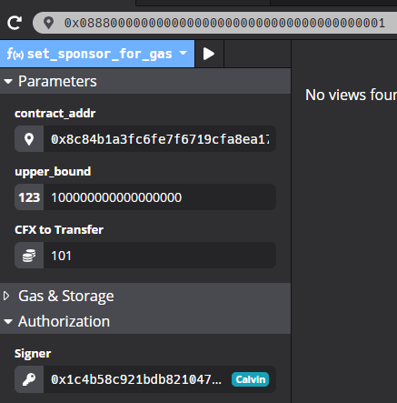

# Homework of Lecture 6

> [Lecture 6 - Homework & Resources](https://forum.conflux.fun/t/topic/3741)
>
> > Homework is done by a group.

## 1. Answer the following questions in a few sentences using your own words.

1.a) Why does Ethereum price EVM instructions in GAS instead of using ETH directly?

> *GAS refers to the computational power required from miners to validate the transaction or smart contract. ETH is the currency used to compensate miners for the GAS required to do the computational work. GAS consumption values are relatively static, while the price of ETH is dynamic and changes overtime.* 
>
> *Charging instructions in GAS thus makes it easier for miners to measure the **cost-benefits of a computation*** *and planning their work.*

1.b) What is the goal of the gas sponsorship mechanism introduced in Conflux?

> *Transactions costs on the blockchain are traditionally paid by the user, who benefits from the blockchain network feature.* 
>
> *However, as with the case in any other economy, costs are always* ***pain points*** *and discourages adoption. Adoption is critical for building an ecosystem which value increases from network externalities, which precisely the case with most blockchain networks. In addition,* ***blockchain is not necessarily used to facilitate transactions***, *so there is the possibility that users of the network do not have any deposited amount with which to pay the transaction fee.*
>
> *The gas sponsorship mechanism therefore 1) removes a barrier to adoption of the network by new users and 2) increases the application scenarios / flexibility of the smart contract.*

1.c) What steps should a developer take so that users of their smart contract do not have to pay for gas?

> *Implement the Gas Sponsorship Mechanism: allow anyone willing to pay to become a “Sponsor”, donating funds to any contract to pay for the transactions of other whitelisted users (usually new ones with 0 account balance).*
>
> *Several parameters to include:*
>
> 1. *Sponsor - records the account providing sponsorship funds for the smart contract*
> 2. *Sponsor balance - records the current balance of the sponsorship funds for the smart contract*
> 3. *Sponsor limit per transaction - sets an upper limit of funds for individual transactions*
> 4. *Whitelist - records, or limits, the accounts that can be sponsored/funded by the smart contract*

## +1. Gas cost of token transfers [OPTIONAL]

Download lecture-5’s CourseToken project ([github.com/Thegaram/cfx-uma-resources/raw/master/cfx-lecture-5.zip 2](http://github.com/Thegaram/cfx-uma-resources/raw/master/cfx-lecture-5.zip)) or use your own version.

Send some tokens to a new address. How much were you charged for this transfer? Try to explain why.

How does the fee change if you send some more tokens to the same address again?

> Create a new "CourseCoin" contract:
>
> 
>
> **Send some tokens to a new address**:
>
> 
>
> - **How much were you charged for this transfer?**
>   - sent `10`, "gasUsed": "**35819**" with gas limit "1000000", and "gasPrice": 100
>   - ~~Before Vel has CFX: **`34363.0111445711547907 CFX`**~~
>     - ~~SUDDENLY I realize that "Vel" is mining to gain more CFXs. So it won't work this way.~~
>   - Created another new "CourseCoin" contract with "Calvin"
>     - Before Calvin has CFX: **`9997.756835937425` CFX**
>     - After Calvin has CFX:    **`9997.69433593735` CFX**
>     - So, total cost is: <strong>`0.06250000007457857` CFX</strong>
>
> **Try to explain why.**
>
> We have the calculation form for this as follows:
>
> > *so what you will pay is*
> >
> > 
<strong>(<i>gas_used</i> x <i>gas_price</i>) + (<i>1/16 CFX</i> x <i>storage_collateralized</i>)</strong>

> >
> > *… minus the refund of at mos*t <strong><i>1/4</i> x <i>gas_used</i> x <i>gas_price</i></strong>
>
> - <i>gas_used</i> x <i>gas_price</i> = `35819 * 100` = 3581900 Drips = 3.5819e-12 CFX (**In theory**)
>   - But according to the refund policy:
>     - <i>gas_used</i> x <i>gas_price</i> = `3/4 * 1000000 * 100` = 75000000 Drips = 7.5e-11 CFX
> - so we can deduce that:
>   - <i>1/16 CFX</i> x <i>storage_collateralized</i> =  <strong>`0.06250000007457857` CFX</strong> - 7.5e-11 CFX $\approx$ 0.0625 CFX
>   - which also implies: <i>storage_collateralized</i>  $\approx$ 1
>
> > But still, the numbers doesn't exactly match which is still remaining mystery.
>
> **How does the fee change if you send some more tokens to the same address again?**
>
> - sent `1234`, gasUsed": "**35883**"
> - Calvin now has CFX:   **`9997.694335937275` CFX**
> - total cost is: <strong>`0.000000000075` CFX</strong>
> - It becomes **significantly low**. I think it's because the first transaction include data storage initialization which is expensive (<strong><i>1/16 CFX</i> x <i>storage_collateralized</i></strong>).

## +1. Sponsored ticket sale [OPTIONAL]

Download lecture-4’s Tickets project ([github.com/Thegaram/cfx-uma-resources/raw/master/cfx-lecture-4-tickets.zip](http://github.com/Thegaram/cfx-uma-resources/raw/master/cfx-lecture-4-tickets.zip)) or use your own version.

Change the contract so that people buying tickets through it **do not have to pay any transaction fee**.

> First, trying to find `SponsorWhitelistControl.sol`.
>
> > The `import "github.com/Conflux-Chain/conflux-rust/blob/master/internal_contract/contracts/SponsorWhitelistControl.sol";` doesn't seem working now. Bad news.
>
> But going the website and copying the code is avaliable. And the version is changed. Function Callings are also different.
>
> So I reimplement the `SponsorWhitelistControl.sol` to fit the demand.
>
> 
>
> Now we deploy the ticket contract, and there are few changes in the code:
>
> 
>
> 
>
> > The ticket is priced as 15 CFX for each.
>
> "Leon" has 10000 CFX at first:
>
> 
>
> Leon buys 1 ticket:
>
> 
>
> 
>
> Let's say Jessica wants to sponsor the contract:
>
> 
>
> 
>
> running into a serious trouble...
>
> 
>
> All the sponsor transactions are timeout and reverted, even the ones I directly send from the `0x0888000000000000000000000000000000000001` panel.
>
> After some parameter adjustments, it worked.
>
> **Calvin sponsored 101 CFX to the contract.**
>
> 
>
> Now we can try to buy some more tickets without any charges:
>
> Leon has: **9974.81249999985 CFX**
>
> 
>
> Leon buys 2 tickets: (Each ticket is 5 CFX)
>
> 
>
> Leon has: 9974.81249999985 CFX - 10 CFX =  **9964.81249999985 CFX**
>
> 
>
> Indeed there is no transaction fee for Leon! We made it!